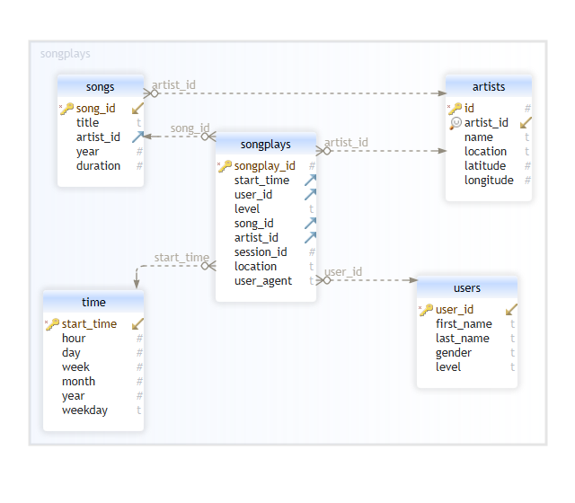

# Designing ETL Pipeline for a Music Streaming company 

This project deals with a database of a music streaming company sparkify. The database contains metadata file for each song, a subset of The Million Songs Database, as well as data of user activity on the app for a period of 2 years, both spread out in multiple json files. The current project requires creating a relational database using star schema which can ease up the analysis goals of the company, mostly, to get an insight into which songs, artists are most users listening to, what are the characteristics of userbase and when and where are they listening to these songs. 

To use this project

1. Create the database and tables

```
$$$ python create_tables.py

```

2. Run the ETL pipeline

```
$$$ python etl.py

```

### Entity Relationship Diagram (Star - Schema)




The Repository contains the following files:

1. ```sql_queries.py``` : Contains all the sql queries related to creation of tables and insertion of data
2. ```create_tables.py``` : To create a new postgres database and create tables defined in sql_queries.py
3. ```etl.ipynb``` : A step by step interactive process to create an ETL pipeline for a single example
4. ```test.ipynb``` : Perform data type, constrains and primary key tests by running this notebook
5. ```etl.py``` : Contains the code for ETL pipeline 


